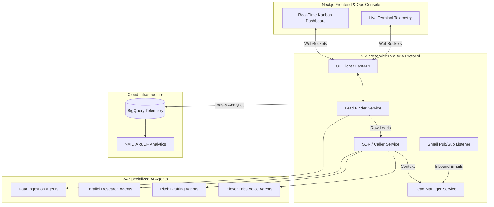

# 🚀 KOE Syndicate: AI-Powered Autonomous SDR Platform


<video src="https://github.com/oyelurker/koe-syndicate/raw/main/UpdatedVideo_Submission_The_Syndicates.mp4" controls="controls" width="100%"></video>

*(If the video player does not load, [click here to watch the Demo Video](https://github.com/oyelurker/koe-syndicate/raw/main/UpdatedVideo_Submission_The_Syndicates.mp4))*

**KOE Syndicate** is a comprehensive AI-powered Sales Development Representative (SDR) system that automates the entire outbound sales process from lead discovery to deal closure. We built this to solve a massive bottleneck in **Local Economic Development and B2B Enterprise Operations**.

It transforms raw, unstructured local community data into actionable intelligence, visualizes it on a live Ops Console, and uses a team of **34 specialized autonomous AI agents** to execute workflows and human-like outreach.

---

## 🎯 The Hackathon Inspiration

The idea for Koe Syndicate came from a real-world problem we witnessed firsthand. A friend of ours was working as a freelance developer, partnering with a sales-savvy friend to generate new business. The process was entirely manual: the salesperson would spend hours cold-calling businesses, trying to find clients who needed a new website. 

It was a classic, manual grind. While their hustle was admirable, it was incredibly time-consuming and inefficient. We thought, *"There has to be a better way."*

What if we could automate that entire process? We built Koe Syndicate to empower anyone to create a significant stream of income using the incredible tools Google provides, turning a manual hustle into a scalable, automated business engine.

---

## 🧠 Architecture: The Multi-Agent Network

Koe Syndicate is not just a single application; it's a comprehensive system of **34 specialized AI agents** (21 LLMAgents, 7 Sequential Agents, 1 Parallel Agent, 2 Custom Agents, 1 Loop Agent) working in concert across **5 microservices** communicating via A2A protocol.

### System Architecture



### The Core Microservices

1. **Lead Finder Agent (`lead_finder`)**
   *   **Role:** The Data Ingestor.
   *   **Action:** Extracts hyper-targeted local business leads based on natural language queries. Enriches lead data with names, websites, phone numbers, and addresses.

2. **SDR Agent (`sdr`)**
   *   **Role:** The Caller & Researcher.
   *   **Action:** Operates as a voice-enabled AI salesperson. Uses fan-out/gather parallel research to analyze a business's digital footprint, formulate a personalized pitch using **Gemini 2.0 Flash**, and execute a real-time, human-like phone call using ElevenLabs.

3. **Lead Manager Agent (`lead_manager`)**
   *   **Role:** The Closer.
   *   **Action:** Monitors a dedicated inbox via Pub/Sub. When a prospect replies, this agent wakes up, uses Gemini to qualify the lead, analyzes the sentiment, and schedules follow-ups.

4. **UI Dashboard (`ui_client` & `frontend`)**
   *   **Role:** The Decision-Support Ops Console.
   *   **Action:** A premium Next.js dark-theme dashboard that monitors the live telemetry of all 34 agents in real-time via WebSockets. It provides the crucial **Human-in-the-Loop oversight** required for enterprise AI adoption.

---

## 💻 Getting Started

### Prerequisites
- Python 3.10+ and Node.js 18+
- Google Cloud Project (BigQuery & Pub/Sub enabled)
- Gemini API Key
- ElevenLabs API Key
- Serper API Key

### Installation & Execution

1. **Clone and Setup Virtual Environment:**
   ```bash
   git clone https://github.com/oyelurker/koe-syndicate.git
   cd koe-syndicate
   python -m venv venv
   source venv/Scripts/activate  # On Windows
   pip install -r requirements.txt
   ```

2. **Setup Frontend:**
   ```bash
   cd frontend
   npm install
   ```

3. **Environment Variables:**
   Copy the `.env.example` file to `.env` in the root directory and fill in your API credentials.

4. **Run the Application (Locally):**
   You only need one terminal window to run the full stack (all 5 microservices + Next.js frontend):
   
   ```bash
   # Windows (Powershell)
   .\deploy_local.ps1
   ```
   
   *Navigate to `http://localhost:3000` to view the live Ops Console!*

---

## 🧪 Demo & Testing Mode

To ensure smooth demonstrations without exhausting API quotas or requiring heavy Google Cloud billing setups during the hackathon, we built a **Mock Testing Mode**.

To enable it, open your `.env` file and set:
```env
MOCK_LEAD_FINDER=true
MOCK_SDR=true
```

### What Mock Mode Does:
1. **Lead Finder:** Bypasses the Maps API and instantly injects Demo Leads into the data pipeline.
2. **SDR Agent:** Simulates the digital footprint analysis and mimics a successful phone call directly in the dashboard telemetry.
3. **Lead Manager:** You can run `python trigger_conversion.py` in a new terminal to mimic a prospect replying to an email, instantly triggering the UI to react.
4. **Database Fallback:** If GCP billing is disabled, the system gracefully skips BigQuery upload and saves the raw data pipeline output to a local `.json` file.

---

## 🏎️ NVIDIA RAPIDS Data Analytics

As part of our data pipeline, we built an analytics module that processes large datasets of lead telemetry. To ensure lightning-fast processing at scale, this module is designed to be accelerated by **NVIDIA RAPIDS (cuDF)**.

To run the data analytics on an NVIDIA GPU using zero-code pandas acceleration:
```bash
# Automatically run pandas operations on the NVIDIA GPU (up to 150x faster)
python -m cudf.pandas analytics_acceleration.py --file demo_leads.json
```

---

**🚀 Built with passion during the hackathon - transforming manual sales processes into AI-powered automation!**
